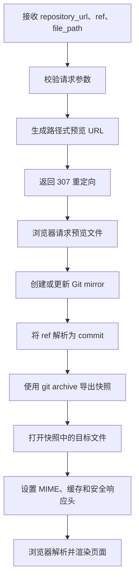

# Preview Service 原理说明

## 1. 服务定位

Preview Service 是一个 Git 仓库静态文件预览服务。

它接收仓库地址、ref 和文件路径，按需拉取仓库，将指定版本导出为静态快照，再通过 HTTP 将 HTML、CSS、JavaScript、图片等文件原样返回给浏览器。

服务端不执行 `npm build`、Makefile 或仓库中的其他脚本。页面的解析、JavaScript 执行和最终渲染均由浏览器完成。

## 2. 预览接口

### 2.1 仓库地址接口

```http
GET /api/preview?repository_url={仓库地址}&ref={ref}&file_path={文件路径}
```

参数说明：

- `repository_url`：匿名可克隆的 HTTP(S) Git 仓库地址。
- `ref`：分支、标签或 commit，必填。
- `file_path`：仓库内需要预览的文件路径。

示例：

```text
/api/preview?repository_url=https%3A%2F%2Fgithub.com%2Falice%2Fdemo.git&ref=main&file_path=site%2Findex.html
```

接口不会直接返回 HTML，而是返回 `307 Temporary Redirect`，跳转到路径式预览地址：

```text
/_preview-url/{repository-token}/{ref-token}/{file-path}
```

其中仓库地址和 ref 使用 Base64 URL 编码。采用路径式地址的目的是保留浏览器的相对路径解析能力。例如 `site/index.html` 中引用 `./css/style.css` 时，浏览器会继续请求同一预览上下文中的 `site/css/style.css`。

### 2.2 WeHub/Gitea 路径接口

服务也保留了基于配置中 WeHub/Gitea 实例的路径接口：

```text
/_preview/{owner}/{repo}/{branch|tag|commit}/{ref}/{file-path}
```

该接口会先通过 WeHub/Gitea API 确认仓库为公开仓库，再进行匿名 clone 或 fetch。

## 3. 请求处理流程



### 3.1 参数校验

仓库地址接口当前接受：

- `http://` 和 `https://` 仓库地址。
- 测试模式下允许 `file://` 地址。

以下地址会被拒绝：

- SSH 仓库地址。
- 带用户名或密码的 URL。
- 带查询参数或 fragment 的仓库 URL。
- 不合法的文件路径，例如空路径、`.`、`..` 或反斜杠路径。

当前任意仓库接口属于 Demo 实现，没有完整的内网地址、DNS 重绑定和外部仓库白名单防护，不应直接作为公网生产接口使用。

### 3.2 Mirror 缓存

服务根据仓库 URL 的 SHA-256 摘要生成缓存标识，并维护裸仓库 mirror：

```text
{cache_directory}/mirrors/remotes/{repository-hash}.git
```

首次访问执行：

```text
git clone --mirror
```

后续访问根据 `fetch_interval` 执行：

```text
git remote update --prune
```

同一个仓库的更新操作使用互斥锁串行执行，避免并发 clone、fetch 或快照发布互相冲突。

### 3.3 Ref 解析

服务按以下顺序解析传入的 `ref`：

1. 当 ref 符合 commit ID 格式时，尝试按 commit 解析。
2. 尝试匹配 `refs/heads/{ref}` 分支。
3. 尝试匹配 `refs/tags/{ref}` 标签。

最终通过 `git rev-parse` 得到完整 commit ID。后续快照始终基于 commit 生成，避免导出过程中分支发生变化。

### 3.4 快照生成

服务执行：

```text
git archive --format=tar {commit}
```

然后将 tar 内容解压到：

```text
{cache_directory}/snapshots/remotes/{repository-hash}/{commit}/
```

快照生成过程具有以下限制：

- 限制最大文件数量。
- 限制快照总字节数。
- 拒绝路径穿越和绝对路径。
- 忽略软链接和硬链接。
- 使用临时目录完成解压后再原子发布。

同一个 commit 的快照只需生成一次。

## 4. 文件响应与浏览器渲染

服务根据文件扩展名设置 `Content-Type`，然后通过 Go 的 `http.ServeContent` 原样返回文件。

常见映射包括：

- `.html` → `text/html`
- `.css` → `text/css`
- `.js`、`.mjs` → `text/javascript`
- `.json` → `application/json`
- `.png`、`.jpg`、`.webp`、`.svg` → 对应图片类型
- `.woff`、`.woff2`、`.ttf` → 对应字体类型

服务不修改 HTML，也不重写 CSS、JavaScript 或图片地址。相对资源能否加载取决于仓库内的目录结构和页面中使用的路径。

Git LFS pointer 不会被当作实际文件返回。当前版本不下载 Git LFS 对象。

## 5. JavaScript 与 CSP Sandbox

HTML 和 JavaScript 会在浏览器中执行，但响应带有 CSP sandbox：

```text
sandbox allow-scripts allow-same-origin allow-forms allow-popups
```

当前策略允许：

- 执行 JavaScript。
- 加载同源静态资源。
- 提交表单。
- 打开普通弹窗页面。

当前策略不包含 `allow-modals`，因此浏览器会阻止：

- `alert()`
- `confirm()`
- `prompt()`
- `beforeunload` 对话框

控制台出现 `Ignored call to 'alert()'` 并不表示 JavaScript 没有执行，而是脚本已经调用了 `alert()`，随后被 sandbox 策略拦截。

如果业务需要这些模态对话框，可以在评估安全影响后增加 `allow-modals`。

## 6. HTTP 缓存

服务根据预览类型设置缓存策略：

- commit 预览：长期缓存并标记 `immutable`。
- 分支和标签预览：每次重新验证。

每个文件响应都包含基于 commit 和文件路径生成的 ETag。浏览器发送匹配的 `If-None-Match` 时，服务返回 `304 Not Modified`。

## 7. Git 运行隔离

Git 命令运行时：

- 禁止交互式凭据输入。
- 禁止读取系统 Git 配置。
- 禁止读取全局 Git 配置和凭据。
- 每次 Git 操作受 `git_timeout` 限制。

这些措施可以避免服务意外使用宿主机上的开发者凭据。

## 8. 配置

服务仅从 YAML 配置文件读取配置：

```yaml
listen_address: ":3001"
allowed_host: "preview.localhost:3001"
git_base_url: "http://localhost:3000"
cache_directory: "./data"
fetch_interval: "2s"
max_archive_bytes: 536870912
max_archive_files: 100000
git_timeout: "2m"
```

启动命令：

```sh
go run ./cmd/server -config config.yaml
```

`allowed_host` 用于隔离预览域。请求的 HTTP Host 不匹配时，预览接口返回 404。

## 9. 核心代码

- `cmd/server/main.go`：加载配置并启动 HTTP 服务。
- `internal/preview/config.go`：读取和校验 YAML 配置。
- `internal/preview/server.go`：预览接口、重定向、文件响应和安全响应头。
- `internal/preview/repository.go`：Git mirror、ref 解析和快照生成。

## 10. 原理总结

Preview Service 的核心不是“在服务端运行网页”，而是：

1. 获取指定 Git 仓库和版本。
2. 将版本固化为 commit 快照。
3. 按静态文件方式返回仓库内容。
4. 由浏览器加载关联资源、执行 JavaScript 并完成渲染。

这种方式实现简单，不执行不可信仓库代码，适合预览已经提交到仓库中的静态站点文件。
